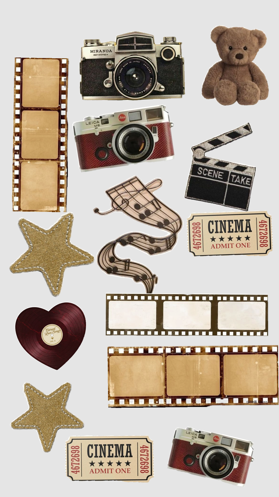

# Digital Stickers

## Digital stickers are a fun way to add a decorative accent to your collage. You can find various styles of stickers online with [[tools-and-apps.md]] . Using a transparent png file makes it easier due to the transparent background. 

> There is apps available to help remove the background if the sticker you would like to use isn't already a png with a transparent background.

### Digital Sticker Styles

1. Planner Icons- You can find images of pins, banners, stars, buttons to highlight specific memories.
2. Washi Tape Strips- There is images available of different washi tape strips and you can find different colors too.
3. Frames- I have seen polaroid frames, vintage style frames, regular border like frames and they're a fun way to add different elements to your collage. 
4. Styles- You can find realistic style stickers, cartoon style, and any other style that will fit your collage.

 
 