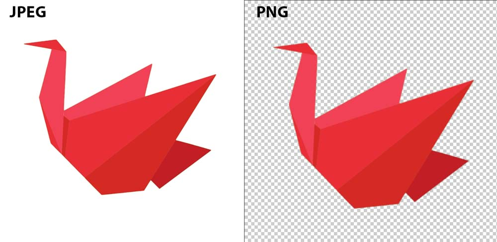

# Exporting Digital Pages

## Digital scrapbook pages/ collages are very busy typically and it's necessary to make sure your export settings are chosen correctly.  You can add your printed page to a physical scrapbook you have, or to just simply have a physical copy. A majority of [[tools-and-apps]] will allow the setting option that will be below. 

> You may not always want to print your pages, and that's okay. If you do choose, having the proper settings saves times and headache.

### Common Export Specifications 

1. Resolution- The most common and standard resolution for printing is 300 DPI.
2. PNG- This format has clean graphic lines and is the ideal format for transparency elements.
3. JPEG- This format is mostly used for in web displays or photo printing.

