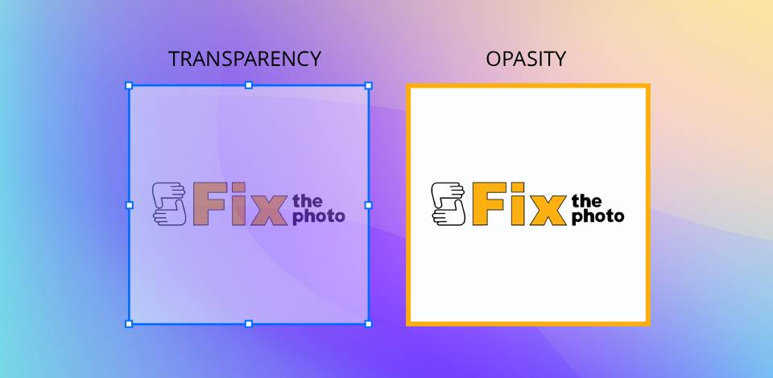

# Media Layering
## With proper media layering you can add depth and make your scrapbook page/ collage more visually complex. It gives a clearer idea of your creativity because you can play with the visuals and techniques. 

>Media layering also can help your images and photos stay organized because you don't have to worry about interrupting one image, photo, [[digital-stickers]], or etc with another. 

### Common Layering Techniques

1. Overlays- This technique allows for your image to give a different feel and looks best done subtly in my opinion.
2. Drop Shadow- This technique can be a fun way to make your image appear lifted.
3. Opacity- This allows for an image to be on the page but not necessarily be the main focus. 

