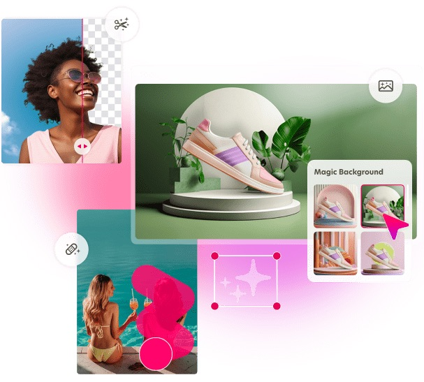

# Tools and Apps

## There's so many different apps out for just about anything.  You can find a multitude of apps that will help you edit images, crop, filter, and edit in any way.  The ones I will list below are a few of my favorites that I use most often.  They are beginner friendly and they each hold their own purpose. 

> I have my preferred apps which I will be sharing but finding an app that you feel comfortable to edit your images is key.

### Recommended Apps 

1. Bazaart- This app is the main one that I use for collages. I especially like it because I use it to remove the background from images so that I can create my own [[digital-stickers]].
2. Canva- This app is my favorite for creating layouts, posters, and presentations. 
3. Pinterest- I find a lot of great images here.
