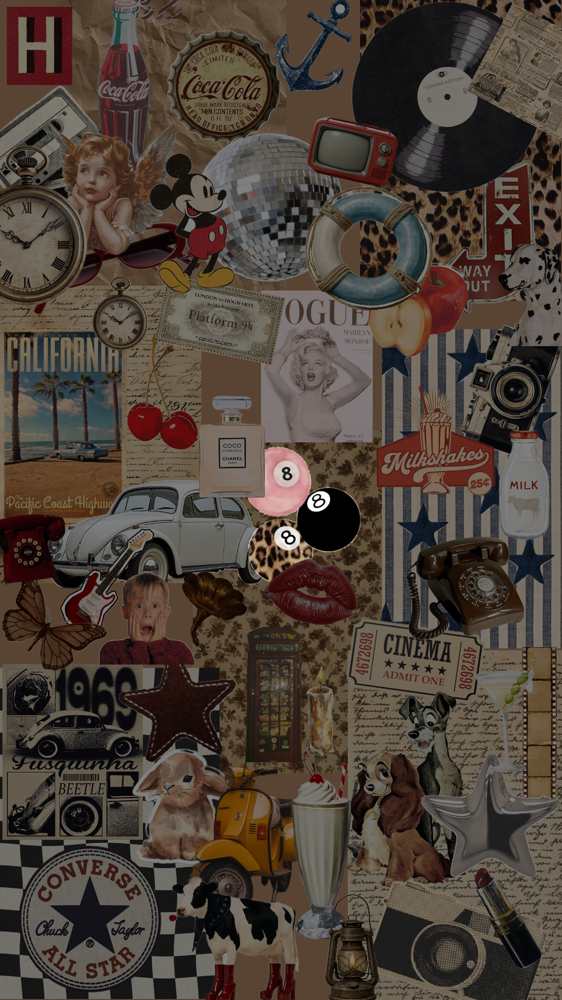

# Aesthetic Styles

## The style and aesthetic applies in all levels of creativity and art. You can even have multiple aesthetics. The purpose of them is to establish a mood and show a clear artistic direction. 

>Your aesthetic can change on trends, points of life and other factors.

### Aesthetic Style Examples

1. Vintage- This style is sepia tones, and aged textures and images.
2. Minimalist- This style is mostly whites and greys, little to no colors and clean layouts.
3. Vibrant- This style is bright colors and busy [[layout-themes]].

