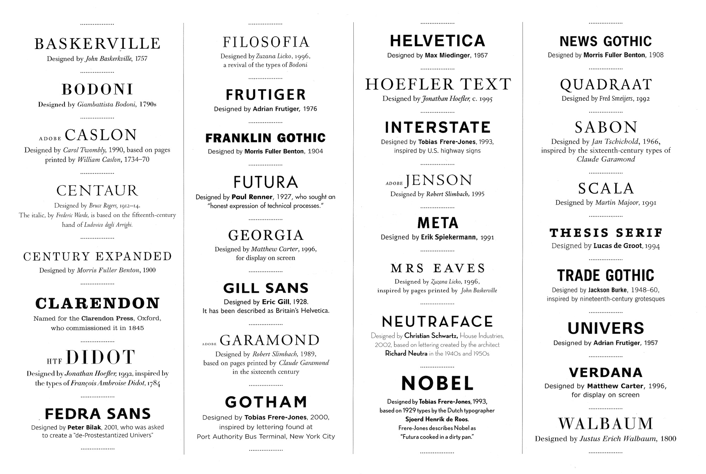

# Typography and Fonts

## The font and lettering that you choose can make or break your pages. They have to be cohesive and not try to over power each other. Not only the type of font that you use can have an affect on your page, but also the font size and style.

> Fonts are also a major factor to consider when looking at your pages [[aesthetic-styles]].

### Popular Fonts
1. Modern- Include: Roboto, Monstserrat, and Helvetica
2. Traditional- Include: Times New Roman, Arial, Garamond, and Didot
3. Artistic- Include: Pacifico, Rockwell, and Apricots

