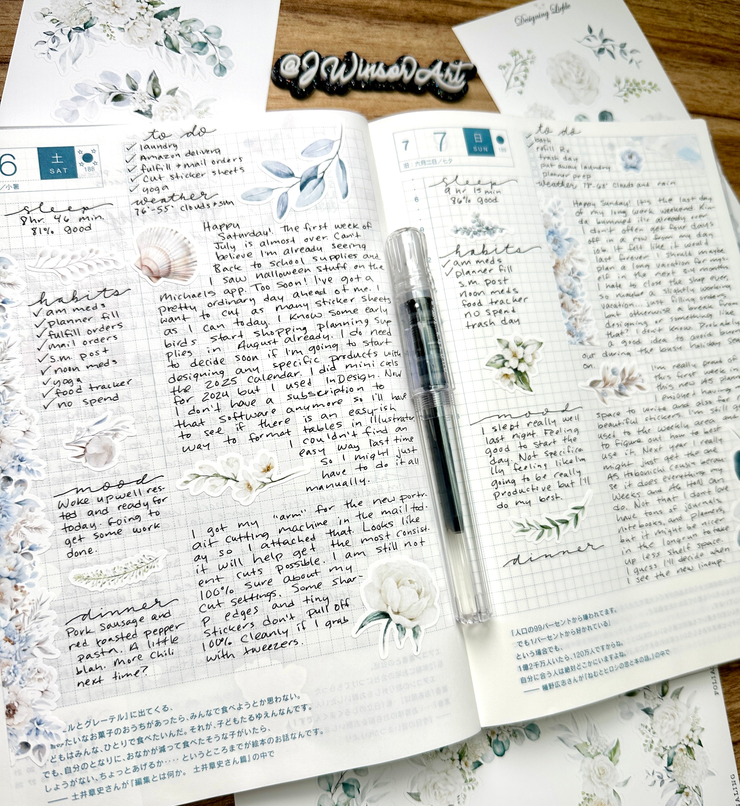

# Daily Journaling Prompts

## Having a different prompt to either start or end your day is a really great way to reflect and writing promotes creativity. It's also a great way to look back and have [[memories]] of your days.

> Getting your brain to sit there and make your reflections on your day into words you write down is a good habit to start. 

### Prompt Examples
1. What is one thing you look forward to today or enjoyed about your day?
2. What was the most surprising moment?
3. What challenges, if any, did you face today?
4. Did my day reflect my goals?
5. What can you expect from tomorrow?

