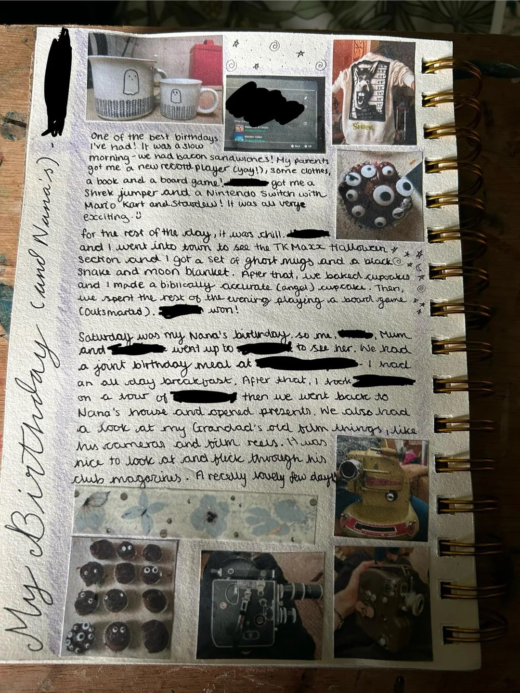

# Memories

## Documenting personal memories wether that's with media, physical items, images writing about it transforms them all into something to look back to for as long as possible.

>You can incorporate your memory into a [[daily-prompts]]

### Memory Styles

1. Letters- Writing letters to yourself is a very personable thing.
2. Direct Dialogue- Writing down any memorable things that you may want to remember.
3. Captions- These can be small paragraphs with all of the details you may want to remember. 

