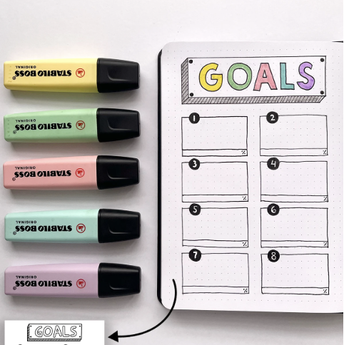

# Milestones and Goals

## Journaling your milestones and goals is a way for you to look back and keep you motivated to achieve what you want for yourself. It's also a nice way to have them writing down for [[memories]].

> Journaling your goals can also be considered a vision board with more writing.

# Milestone Categories

1. Personal Achievements- This can be anything from career related, family, home moves or anything you want to achieve for yourself.
2. Celebrations- Birthdays, graduations, weddings and anything major that you would like to remember
3. Reflections- This can be reflections of any challenges or ways that you feel you have grown. 

