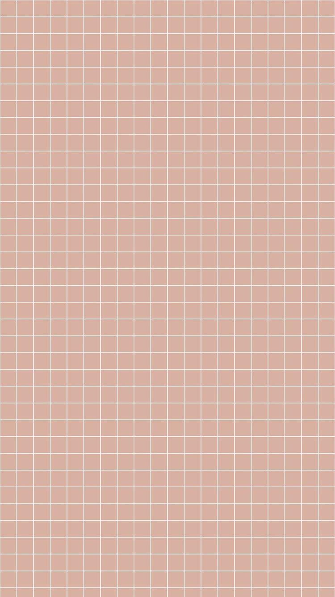

# Backgrounds

## The background of your page typically sets the foundation of your layout. It is typically what gets chosen first,  so that the tone and [[aesthetic-styles]] matches all around.

> The background can have a high opacity or it can have a low one. If you feel like your page will be too busy and hectic with one, you can opt out of having a background. 

### Background Types

1. Solid
2. Patterns
3. Distressed
4. Watercolors
5. Gradients
6. Textured

