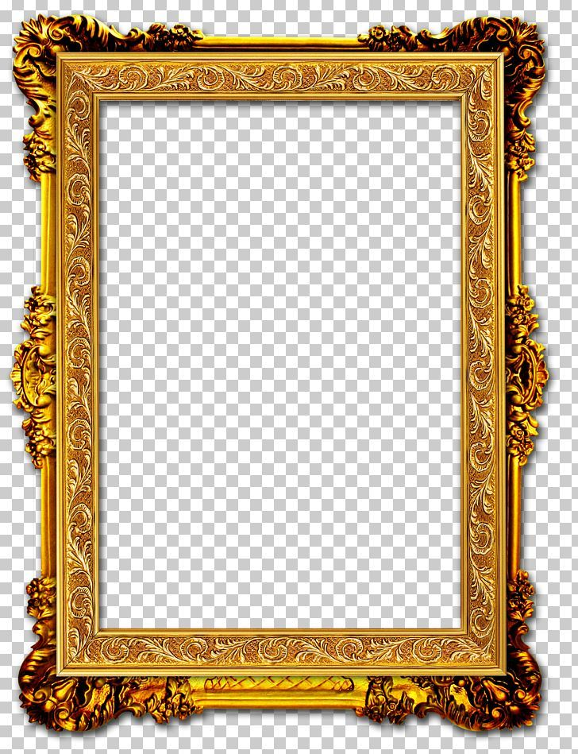

# Frames

## Frames help emphasize a photo and bring extra attention to is. Frames also help isolate an image  from a busy background. They do in a digital sense what they do in a physical one. 

> Frames also help add color and make images look [[aesthetic-styles]] pleasing.

### Popular Frames

1. Polaroids
2. Vintage
3. Wood
4. Layered Mats

