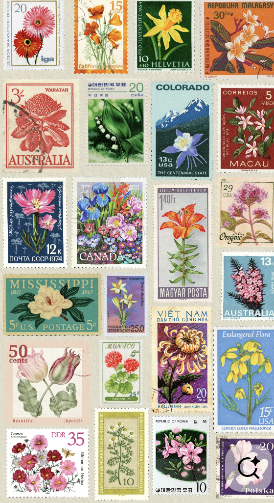

# Stamps
## Stamps help add different kinds of art to your pages and it also gives a texture element providing more versatile collages. Stamps can also be a really good way to incorporate your [[color-palettes]] into your creation because they can be very colorful. 

> If doing physical stamps, it's a fun step to add to your scrapbooking process.

###  Stamp Styles

1. Postal Stamps
2. Floral Stamps
3. Ink Splatters
4. Wax Stamps

