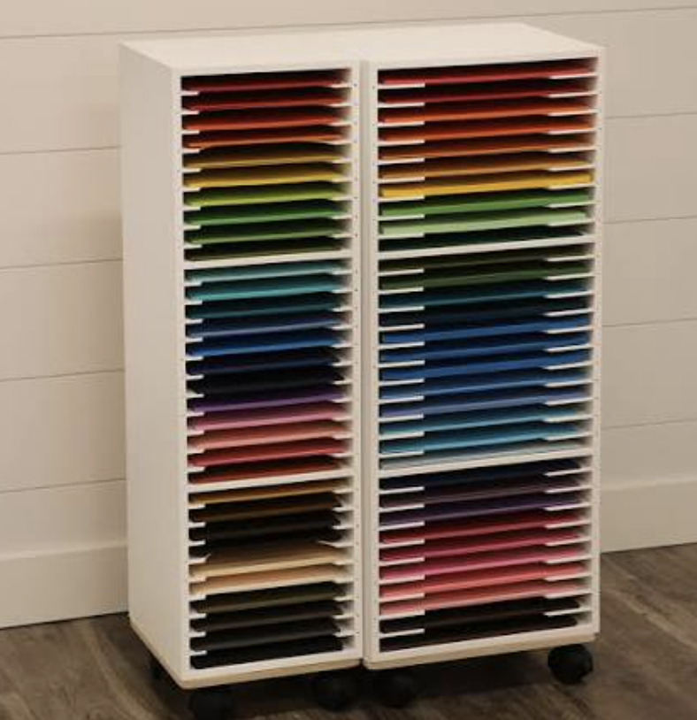

# Paper Storage

## Like mentioned previously in [[bin-and-drawers]] organization is really important anywhere. Paper is one of the more sensitive items, so in order to prevent warping and fading it is best they get stored correctly. 

> Having the proper paper storage prevents duplicate purchases.

### Storage Methods

1. Paper Racks
2. Drawer Tray
3. File Folders
4. Paper Caddies

