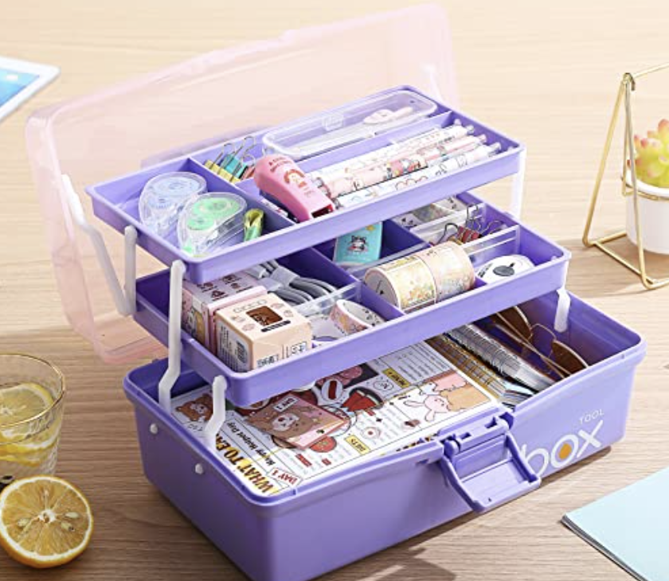

# Tool Organizers

## When scrapbooking you accumulate a lot of tools and having the proper organization for them allows for them to be reachable, just like [[paper storage]]. When you are in a creative zone you don't want to jeopardize that by having to go searching for tools.

> Supplies typically needed are trimmers. brushes, puncturing tools, markers and even heat tools sometimes. 

### Tool Storage

1. Caddies
2. Wall Racks
3. Pen Trays
4. Pouches

